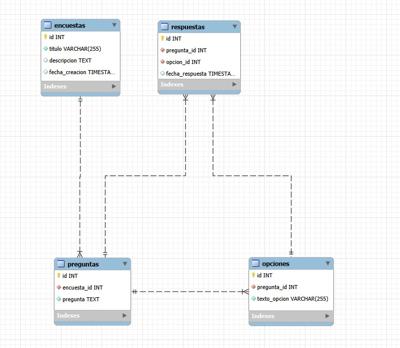
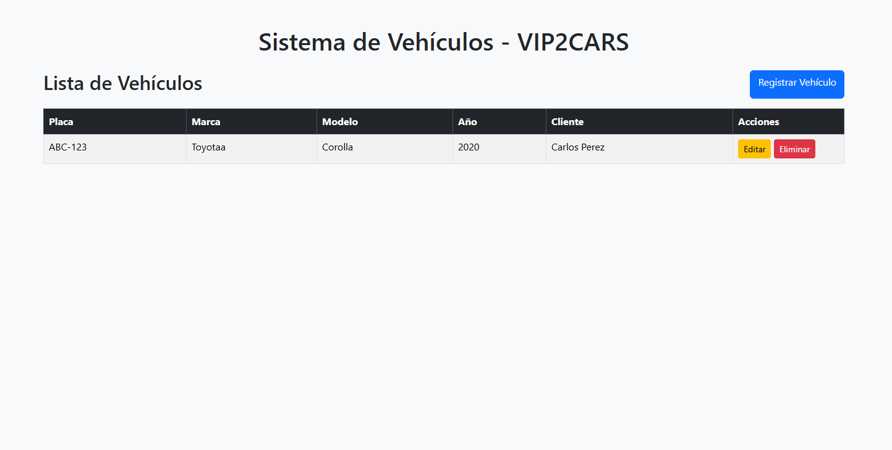
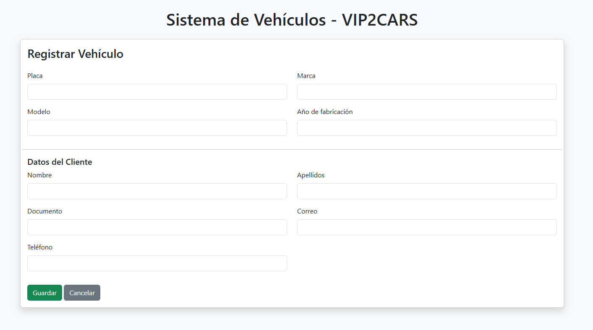
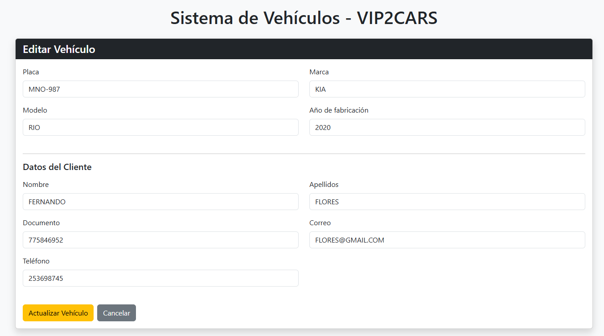

## Pregunta 1: Modelo de Base de Datos

El modelo de base de datos del sistema de encuestas anónimas se encuentra representado en el siguiente diagrama.

## Pregunta 2: Instalación y ejecución del proyecto

=====================================================
DOCUMENTACIÓN DEL SISTEMA
VIP2CARS – Sistema de Gestión de Vehículos
=====================================================

1. REQUISITOS DEL ENTORNO

Para ejecutar el sistema se requiere el siguiente entorno:

Servidor
-------------------------------------
PHP: 8.1 o superior
Laravel: 10.x
Composer: 2.x

Base de datos
-------------------------------------
MySQL o MariaDB

Nota:
La base de datos del sistema se gestiona mediante migraciones
de Laravel. MySQL se utilizó únicamente para visualizar el
diagrama del ejercicio de encuestas.

Extensiones PHP necesarias
-------------------------------------
PDO
pdo_mysql
mbstring
openssl
tokenizer
ctype
json
fileinfo
bcmath

Para verificar extensiones instaladas:

php -m

=====================================================
2. INSTALACIÓN Y CONFIGURACIÓN
=====================================================

1. Clonar el repositorio

git clone https://github.com/MRJONABP/vip2cars

2. Entrar al proyecto

cd vip2cars

3. Instalar dependencias

composer install

4. Configurar variables de entorno

Copiar el archivo de configuración:

cp .env.example .env

Editar el archivo .env con los datos de la base de datos:

APP_NAME=VIP2CARS
APP_ENV=local
APP_KEY=
APP_DEBUG=true
APP_URL=http://localhost

DB_CONNECTION=mysql
DB_HOST=127.0.0.1
DB_PORT=3306
DB_DATABASE=vip2cars
DB_USERNAME=root
DB_PASSWORD=

5. Generar la clave de Laravel

php artisan key:generate

=====================================================
3. PUESTA EN MARCHA DEL PROYECTO
=====================================================

Ejecutar migraciones para crear la base de datos

php artisan migrate

Iniciar el servidor del proyecto

php artisan serve

El sistema estará disponible en:

http://127.0.0.1:8000

=====================================================
4. ESTRUCTURA DE LA BASE DE DATOS
=====================================================

La base de datos es gestionada mediante migraciones
de Laravel.

Tabla principal:

vehicles

Campos de la tabla

id
placa
marca
modelo
anio_fabricacion
cliente_nombre
cliente_apellidos
cliente_documento
cliente_correo
cliente_telefono
created_at
updated_at

=====================================================
5. DIAGRAMA DE BASE DE DATOS
=====================================================

+-------------------------------------+
|              vehicles               |
+-------------------------------------+
| id (PK)                             |
| placa                               |
| marca                               |
| modelo                              |
| anio_fabricacion                    |
| cliente_nombre                      |
| cliente_apellidos                   |
| cliente_documento                   |
| cliente_correo                      |
| cliente_telefono                    |
| created_at                          |
| updated_at                          |
+-------------------------------------+

El sistema utiliza una estructura simple CRUD
con una sola tabla principal.

=====================================================
6. FUNCIONALIDADES DEL SISTEMA
=====================================================

Gestión de vehículos

Registrar vehículos
Editar vehículos
Eliminar vehículos
Listar vehículos
Buscar vehículos

Información del cliente

Cada vehículo almacena:

Nombre del cliente
Apellidos
Documento
Correo electrónico
Teléfono

=====================================================
7. CARACTERÍSTICAS IMPLEMENTADAS
=====================================================

CRUD completo
Validaciones en formularios
Manejo de errores
Búsqueda por placa, marca y modelo
Paginación de resultados
Confirmación antes de eliminar registros
Interfaz utilizando Bootstrap
Arquitectura MVC de Laravel

=====================================================
8. ESTRUCTURA DEL PROYECTO
=====================================================

vip2cars

app
 ├── Http
 │   └── Controllers
 │       └── VehicleController.php
 │
 └── Models
     └── Vehicle.php

database
 └── migrations

resources
 └── views
     └── vehicles
         ├── index.blade.php
         ├── create.blade.php
         └── edit.blade.php

routes
 └── web.php

=====================================================
9. USUARIO DEMO
=====================================================

Este sistema no requiere autenticación.

Se puede acceder directamente a:

http://127.0.0.1:8000/vehicles

=====================================================
10. TECNOLOGÍAS UTILIZADAS
=====================================================

Laravel 10
PHP 8
MySQL
Bootstrap 5
Blade Templates
Composer

=====================================================
AUTOR
=====================================================

Jonathan Lee Becerra Peña

Sistema desarrollado con Laravel para la gestión
de vehículos y clientes.

=====================================================

## Vista Web

